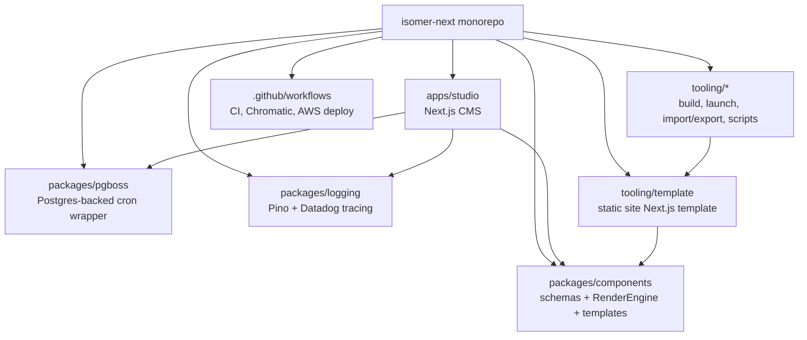
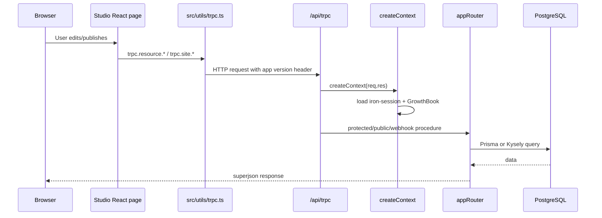
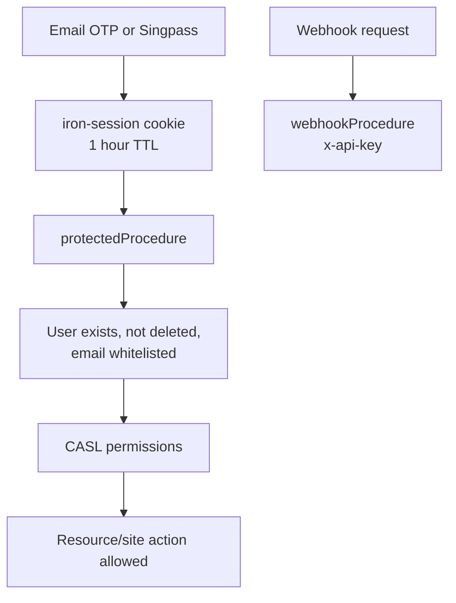
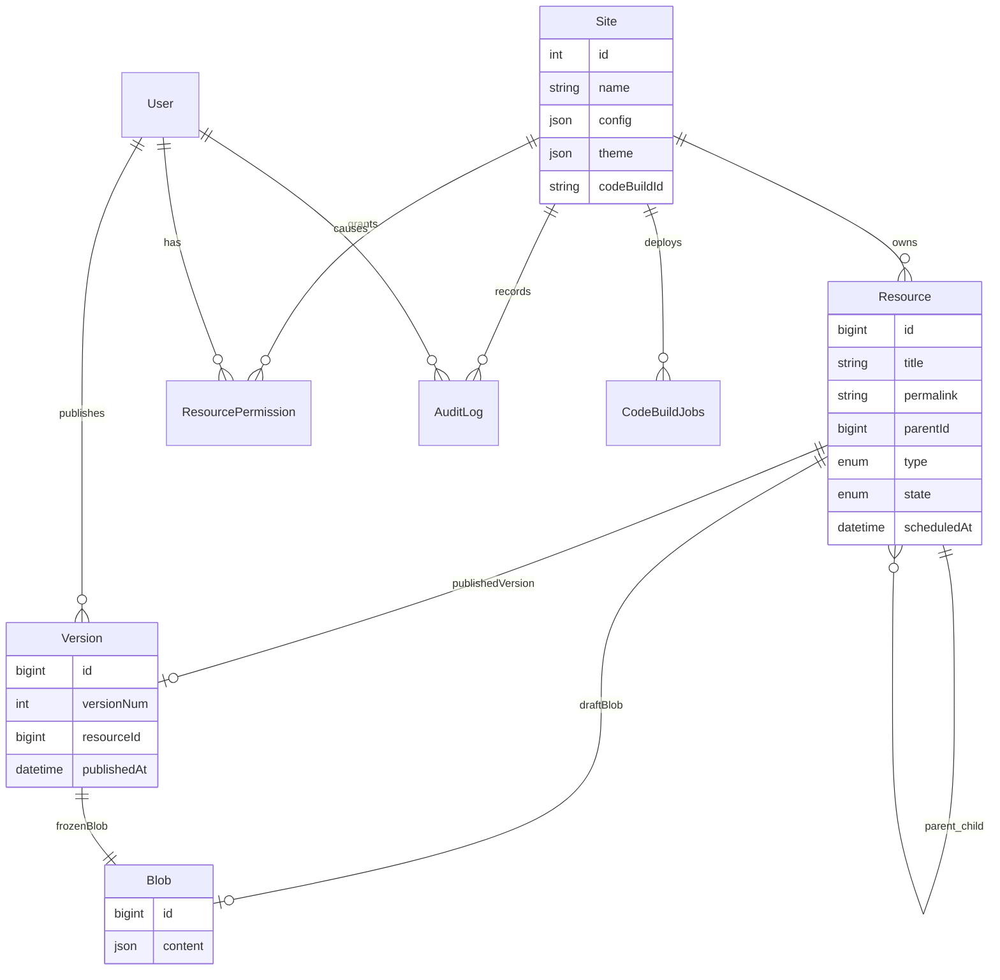
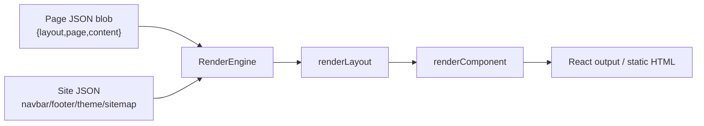
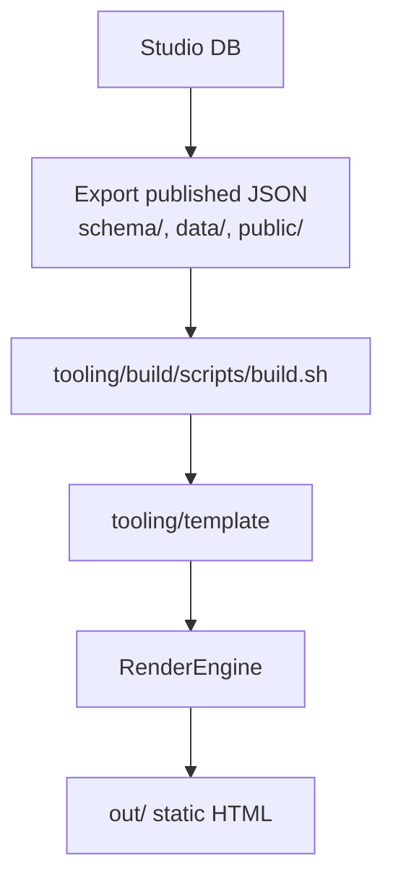
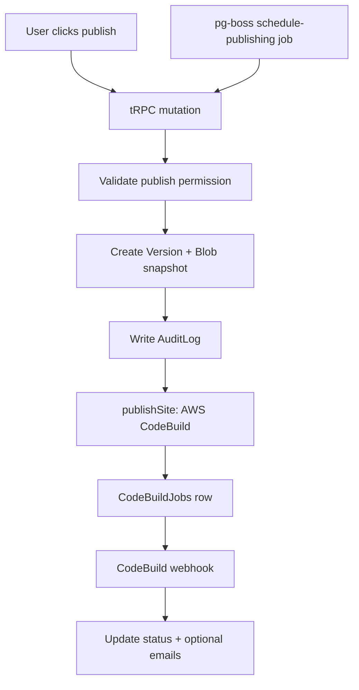
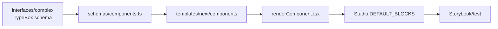

# Isomer Next codebase summary

Isomer Next is a pnpm/Turborepo monorepo for building, editing, publishing, and rendering government websites. The main product is **Studio**, a Next.js CMS (`apps/studio`) where users manage site content. Shared packages define the page JSON schemas, rendering engine, background jobs, logging, and operational tooling used to publish static sites.

## 1. Repository map



| Area | What it does | Key files |
| --- | --- | --- |
| `apps/studio` | CMS UI and backend API for editors, publishers, admins, auth, assets, permissions, deploy triggers | `src/pages`, `src/server/modules`, `prisma/schema.prisma` |
| `packages/components` | Public content contract: schemas, types, renderer, layouts, blocks, site utilities | `src/index.ts`, `src/schemas`, `src/engine/render.tsx`, `src/templates/next` |
| `tooling/template` | Static-export Next.js site shell used during publish builds | `app/[[...permalink]]/page.tsx`, `data`, `schema`, `sitemap.json` |
| `packages/pgboss` | Thin wrapper around `pg-boss` for scheduled jobs | `src/client.ts` |
| `packages/logging` | Shared Pino logger and Datadog tracer setup | `src/logger.ts`, `src/tracer.ts` |
| `tooling/*` | Site build/publish scripts, migration/import/export, launch automation, shared configs | `tooling/build`, `tooling/site-launch`, `tooling/export-import` |

## 2. What the system is used for

1. **Create and manage sites** in Studio.
2. **Edit structured page JSON** through schema-driven forms and rich-text editors.
3. **Validate content** against schemas from `@opengovsg/isomer-components`.
4. **Preview pages** by rendering draft JSON with the same `RenderEngine` used by published sites.
5. **Publish content** by versioning resources, exporting JSON, and triggering AWS CodeBuild/static-site builds.
6. **Operate sites** with background jobs, audit logs, RBAC, asset uploads, CI, and deployment tooling.

## 3. Runtime architecture

### Studio request flow

Studio uses Next.js pages plus tRPC. React pages call typed tRPC hooks; requests enter `/api/trpc`; context loads the `iron-session` cookie, database clients, GrowthBook flags, and request metadata.



Key files:

- tRPC client: `apps/studio/src/utils/trpc.ts`
- API handler: `apps/studio/src/pages/api/trpc/[trpc].ts`
- Context: `apps/studio/src/server/context.ts`
- Procedure middleware: `apps/studio/src/server/trpc.ts`
- Root router: `apps/studio/src/server/modules/_app.ts`

Root routers currently include:

```ts
export const appRouter = router({
  healthcheck: publicProcedure.query(() => "yay!"),
  me: meRouter,
  auth: authRouter,
  asset: assetRouter,
  page: pageRouter,
  folder: folderRouter,
  collection: collectionRouter,
  gazette: gazetteRouter,
  site: siteRouter,
  resource: resourceRouter,
  user: userRouter,
  whitelist: whitelistRouter,
  webhook: webhookRouter,
})
```

### Authentication and authorization



- Auth methods: email OTP, optional Singpass OIDC.
- Server enforcement: `protectedProcedure` in `src/server/trpc.ts`.
- Permissions: CASL abilities from `ResourcePermission`.
- Roles: `Editor`, `Publisher`, `Admin`; platform admins are in `IsomerAdmin`.
- Client UI checks: `src/features/permissions/PermissionsContext.tsx`.

## 4. Database and content model

The database is PostgreSQL via Prisma and Kysely. Prisma owns schema/migrations; Kysely is used for type-safe SQL in more complex queries.



Core idea:

- `Resource` is the tree node for pages, folders, collections, collection links, and index pages.
- `Blob.content` stores page JSON.
- A draft `Resource` points to a mutable draft blob.
- Publishing creates a `Version` pointing at an immutable blob snapshot.
- Site-wide config lives on `Site`, `Navbar`, `Footer`, and related JSON columns.

Important schema files:

- Prisma schema: `apps/studio/prisma/schema.prisma`
- Prisma client: `apps/studio/src/server/prisma.ts`
- Kysely DB: `apps/studio/src/server/modules/database`

## 5. Rendering and publishing

### Rendering stack

The components package is both the validation contract and the rendering engine.



Key paths:

- `packages/components/src/engine/render.tsx`: entry point.
- `packages/components/src/templates/next/render/renderLayout.tsx`: layout switch.
- `packages/components/src/templates/next/render/renderComponent.tsx`: component/block switch.
- `packages/components/src/schemas`: JSON schemas and scoped schemas.

Published sites are built with `tooling/template`, a static-export Next.js app:



The template route `tooling/template/app/[[...permalink]]/page.tsx`:

1. Generates static params from `sitemap.json`.
2. Imports the matching `schema/*.json` page blob.
3. Merges `data/config.json`, `data/navbar.json`, and `data/footer.json`.
4. Calls `RenderEngine`.

### Publish/deploy flow



Key files:

- Page/resource publish: `apps/studio/src/server/modules/resource/resource.service.ts`
- Site config publish: `apps/studio/src/server/modules/site/site.router.ts`
- CodeBuild integration: `apps/studio/src/server/modules/aws/codebuild.service.ts`
- Webhook router/API: `apps/studio/src/server/modules/webhook`, `src/pages/api/webhooks`
- Cron registration: `apps/studio/src/instrumentation.ts`, `src/server/cron`

## 6. Development workflow

Common root commands:

```bash
pnpm install
pnpm dev
pnpm build
pnpm lint
pnpm format
pnpm typecheck
pnpm test:e2e
```

Studio-specific commands from `apps/studio`:

```bash
pnpm setup       # docker services + migrations + seed
pnpm dev         # Next.js Studio app
pnpm test:unit   # Vitest
pnpm test:e2e    # Playwright
pnpm generate    # Prisma + Kysely + JSON types
```

Components package:

```bash
pnpm build       # CJS + ESM package output
pnpm storybook   # component Storybook on port 6006
pnpm test:unit
```

Studio Storybook runs on port 6007.

## 7. How to extend the codebase

### A. Add a new tRPC endpoint

1. Add input/output schemas in `apps/studio/src/schemas/<domain>.ts`.
2. Add a procedure to the relevant `src/server/modules/<domain>/<domain>.router.ts`.
3. Put business logic in `<domain>.service.ts` if it is non-trivial.
4. Enforce permissions before touching data.
5. Use it in React via `trpc.<domain>.<procedure>.useQuery()` or `.useMutation()`.

Example:

```ts
// apps/studio/src/server/modules/example/example.router.ts
export const exampleRouter = router({
  getTitle: protectedProcedure
    .input(z.object({ siteId: z.number(), resourceId: z.string() }))
    .query(async ({ ctx, input }) => {
      await bulkValidateUserPermissionsForResources({
        action: "read",
        resourceIds: [input.resourceId],
        userId: ctx.user.id,
        siteId: input.siteId,
      })

      return db
        .selectFrom("Resource")
        .select(["id", "title"])
        .where("id", "=", input.resourceId)
        .executeTakeFirstOrThrow()
    }),
})
```

Register the router in `src/server/modules/_app.ts`.

### B. Add a new page block/component



Typical steps:

1. Define the TypeBox interface under `packages/components/src/interfaces/complex`.
2. Register it in `packages/components/src/schemas/components.ts`.
3. Implement the renderer under `packages/components/src/templates/next/components/complex`.
4. Add a switch case in `renderComponent.tsx`.
5. Add a default block in `apps/studio/src/components/PageEditor/constants.ts`.
6. Add Storybook coverage and unit tests if behavior is complex.

Renderer shape:

```tsx
export const MyBlock = ({
  title,
  description,
}: {
  title: string
  description?: string
}) => (
  <section>
    <h2>{title}</h2>
    {description ? <p>{description}</p> : null}
  </section>
)
```

### C. Add a new page layout

1. Add the layout type/schema in `packages/components/src/types`.
2. Add it to `LAYOUT_PAGE_MAP` in `packages/components/src/schemas/page.ts`.
3. Create a layout renderer in `packages/components/src/templates/next/layouts`.
4. Add a case in `renderLayout.tsx`.
5. Update Studio page creation and editing flows under `apps/studio/src/features/editing-experience`.
6. Update sitemap/publish logic if the layout changes routing behavior.

### D. Add or change site settings

1. Update site schemas/types in `packages/components/src/types/site.ts` or internal interfaces.
2. Update Studio Zod/AJV validation in `apps/studio/src/schemas/site.ts`.
3. Update settings UI under `apps/studio/src/features/settings`.
4. Persist through `site.router.ts` or resource publish helpers.
5. Render in `RenderEngine`, `renderApplicationScripts`, or the site skeleton as needed.

### E. Add a scheduled job

1. Create a job in `apps/studio/src/server/cron/jobs`.
2. Register it with `registerPgbossJob`.
3. Add it to `initializeCronJobs` in `apps/studio/src/server/cron/index.ts`.
4. Keep handlers idempotent: pg-boss can retry failed work.

Example:

```ts
export const myDailyJob = async () => {
  return registerPgbossJob(
    logger,
    "my-daily-job",
    "0 0 * * *",
    async () => {
      await doWork()
    },
  )
}
```

## 8. Operational notes

- CI runs build, lint, format, typecheck, unit/integration tests, and Playwright E2E from `.github/workflows/ci.yml`.
- AWS deploy workflows build the Studio Docker image, scan it, push to ECR, upload sourcemaps to Datadog, and deploy to ECS via CodeDeploy.
- Datadog tracing starts from `apps/studio/src/instrumentation.ts`.
- Logs are request-scoped child Pino loggers with path, client IP, and trace ID.
- Asset uploads use signed S3/R2 URLs through the `asset` router and `src/lib/s3.ts`.

## 9. Mental model

Think of the system as three contracts:

1. **Editing contract**: Studio stores and validates JSON blobs.
2. **Rendering contract**: `packages/components` turns those blobs into React pages.
3. **Publishing contract**: published blobs are exported into `tooling/template`, statically built, and deployed.

Most changes should start by identifying which contract they touch. If a change affects page JSON shape, update schemas, Studio editors, renderers, publishing/template assumptions, and tests together.
